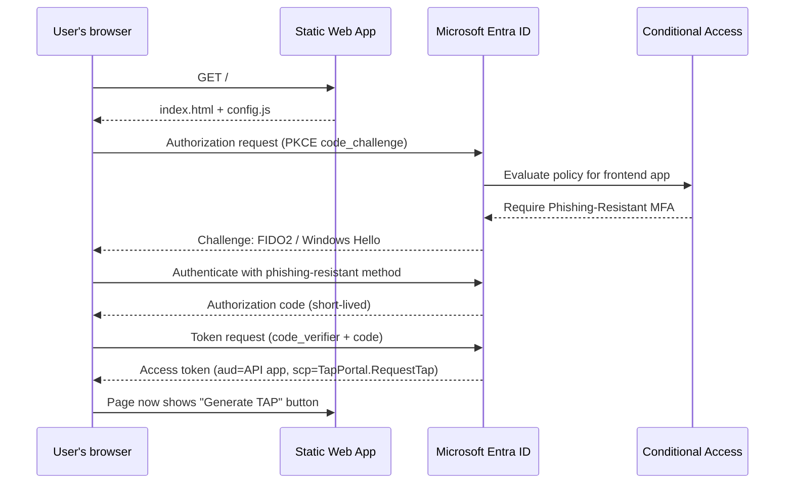
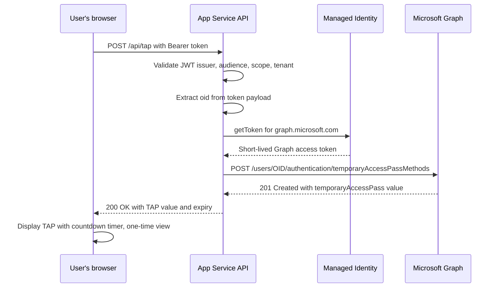

# Temporary Access Pass Portal

A self-service web portal that lets authorized users generate a **Temporary Access Pass (TAP)** for their own Entra ID account — without needing to call the helpdesk. The portal enforces phishing-resistant MFA before any TAP can be issued, making it safe to deploy as a public-facing endpoint.

---

## Table of contents

1. [What this app does](#1-what-this-app-does)
2. [How it is designed](#2-how-it-is-designed)
3. [Authentication flow](#3-authentication-flow)
4. [TAP creation flow](#4-tap-creation-flow)
5. [Prerequisites](#5-prerequisites)
6. [Repository structure](#6-repository-structure)
7. [Step 1 — Enable Temporary Access Pass in your tenant](#step-1--enable-temporary-access-pass-in-your-tenant)
8. [Step 2 — Get the code](#step-2--get-the-code)
9. [Step 3 — Sign in to Azure CLI](#step-3--sign-in-to-azure-cli)
10. [Step 4 — Run the deployment script](#step-4--run-the-deployment-script)
11. [Step 5 — What the script creates](#step-5--what-the-script-creates)
12. [Step 6 — Verify the deployment](#step-6--verify-the-deployment)
13. [Step 7 — Apply Conditional Access](#step-7--apply-conditional-access)
14. [Step 8 — Test end-to-end](#step-8--test-end-to-end)
15. [Security design](#security-design)
16. [Operator runbook](#operator-runbook)
17. [Troubleshooting](#troubleshooting)

---

## 1. What this app does

### The problem

When a user is locked out of their account (lost authenticator, new phone, broken FIDO key), an IT administrator has to create a **Temporary Access Pass** for them using the Microsoft Entra admin center or PowerShell. This is slow, requires elevated admin privileges, and does not scale in large organisations.

### The solution

The TAP Portal is a lightweight web app that allows users to **self-service request a TAP** for their own account. Key properties:

- **No admin involvement** — the user authenticates themselves through Microsoft Entra, and the portal calls Microsoft Graph to create a TAP against the signed-in user's object ID.
- **Phishing-resistant enforcement** — a Conditional Access policy requires phishing-resistant MFA (FIDO2 or Windows Hello) before the portal can be accessed. A user who has already lost their regular authenticator can use their FIDO2 key; a user who has never enrolled can be pre-enrolled and then use this portal to recover.
- **Secretless backend** — the API server uses a **managed identity** to call Microsoft Graph. There is no stored client secret, no Logic App SAS token, and no API key anywhere.
- **One-time TAP** — each TAP is single-use and expires after 60 minutes by default, limiting blast radius.

### Who uses it

| Role | Action |
|---|---|
| **End user** | Visits the portal, signs in (phishing-resistant MFA required), clicks "Generate TAP" |
| **IT operator** | Deploys the portal once, configures Conditional Access, monitors audit logs |
| **Helpdesk** | Receives fewer calls; can point users to the portal |

---

## 2. How it is designed

### Architecture overview

```
┌──────────────────────────────────────────────────────────────────┐
│                         User's browser                           │
│                                                                  │
│  Azure Static Web App                                            │
│  ┌──────────────────────────────────────────┐                    │
│  │  portal-secretless/index.html            │                    │
│  │  MSAL.js  (PKCE auth code flow)          │                    │
│  │  portal-secretless/config.js (runtime)   │                    │
│  └──────────────────────────────────────────┘                    │
│                │                                                 │
│                │  1. Redirect to Microsoft Entra (PKCE)         │
│                │  2. Access token (audience = API app)           │
│                │                                                 │
└────────────────┼─────────────────────────────────────────────────┘
                 │
                 ▼
┌──────────────────────────────────────────────────────────────────┐
│  Microsoft Entra ID                                              │
│  ┌──────────────────────────┐  ┌──────────────────────────┐     │
│  │  Frontend App Reg (SPA)  │  │  API App Reg             │     │
│  │  TAP Portal Frontend     │  │  TAP Portal API          │     │
│  │  Redirect: SWA hostname  │  │  Scope: TapPortal.Request│     │
│  └──────────────────────────┘  └──────────────────────────┘     │
│                                                                  │
│  Conditional Access policy:                                      │
│  App = Frontend App Reg  ──► Grant: Phishing-Resistant MFA      │
└─────────────────────────────────────┬────────────────────────────┘
                                      │
                                      │  Access token (Bearer)
                                      ▼
┌──────────────────────────────────────────────────────────────────┐
│  Azure App Service (Linux, B1)                                   │
│  secretless-api/server.js  (Node.js + Express)                   │
│                                                                  │
│  1. Verify JWT (tenant, issuer, audience, scope)                 │
│  2. Extract oid from token (signed-in user)                      │
│  3. Acquire Graph token via Managed Identity                     │
│  4. POST /users/{oid}/authentication/temporaryAccessPassMethods  │
│  5. Return TAP value to browser (HTTPS only)                     │
│                                                                  │
│  System-assigned Managed Identity ──► Microsoft Graph            │
│  Permission: UserAuthenticationMethod.ReadWrite.All              │
└──────────────────────────────────────────────────────────────────┘
```

### Components

| Component | Technology | Purpose |
|---|---|---|
| **Frontend** | Azure Static Web App | Hosts the single-page app; applies security headers |
| **Backend API** | Azure App Service (Linux B1) | Validates tokens; calls Microsoft Graph |
| **Authentication** | Microsoft Entra PKCE | Browser-native auth code flow, no server-side secret |
| **Graph access** | Managed Identity | Secretless Graph calls; no client secret needed |
| **Infrastructure** | Bicep | Declarative Azure resource provisioning |
| **Monitoring** | Application Insights | Backend telemetry and error tracking |
| **MSAL library** | Vendored (`vendor/msal-browser.min.js`) | Avoids CDN dependency; loaded locally first |

### Design principles

1. **No secrets at rest** — The API never stores a client secret, connection string, or SAS token. Managed Identity provides short-lived tokens on demand.
2. **Least privilege** — The managed identity holds only `UserAuthenticationMethod.ReadWrite.All`. It does not have Global Administrator, User Administrator, or any other directory role.
3. **User-scoped TAPs only** — The TAP is always created against the `oid` extracted from the validated bearer token. The API cannot create a TAP for any other user.
4. **Phishing-resistant gate** — Conditional Access enforces a phishing-resistant authentication strength on the frontend app registration before a token is issued.
5. **Hardened HTTP headers** — The SWA applies CSP, HSTS, X-Frame-Options, COOP, CORP, Referrer-Policy, and Permissions-Policy on every response.

---

## 3. Authentication flow



**Key points:**
- The browser performs the entire PKCE exchange. There is no server-side component involved in authentication.
- The access token audience (`aud`) is the **API app registration**, not the frontend. This prevents token reuse in other contexts.
- The Conditional Access policy targets the **frontend app registration** so it fires at sign-in time, before a token is ever issued.

---

## 4. TAP creation flow



**Key points:**
- The API always creates the TAP against the `oid` of the **signed-in user** from the validated token. There is no user ID in the request body — the API derives it from the token.
- The TAP is single-use (`isUsableOnce: true`) and expires in 60 minutes by default (configurable via `TAP_LIFETIME_MINUTES` app setting).
- The TAP value is shown once in the browser and never stored anywhere. After the page is closed or refreshed, it cannot be retrieved.

---

## 5. Prerequisites

Ensure all tools are installed and you have the required permissions before starting.

### Tools

| Tool | Required version | Install |
|---|---|---|
| PowerShell | 7.0 or later | [docs.microsoft.com](https://learn.microsoft.com/en-us/powershell/scripting/install/installing-powershell) |
| Azure CLI | Latest | `winget install Microsoft.AzureCLI` |
| Node.js | 18 LTS or later | `winget install OpenJS.NodeJS.LTS` |
| npm | Bundled with Node.js | — |
| Git | Any recent version | `winget install Git.Git` |

Verify tools are present:

```powershell
az --version
node --version
npm --version
pwsh --version
```

### Azure permissions

Your account must have the following at minimum:

| Permission | Why |
|---|---|
| **Contributor** on the target subscription or resource group | To create resource group, App Service, Static Web App |
| **Application Administrator** or **Cloud Application Administrator** in Entra | To create app registrations and grant API permissions |
| **Privileged Role Administrator** in Entra | To grant the managed identity the `UserAuthMethod-TAP.ReadWrite.All` app role |
| **Conditional Access Administrator** in Entra | Optional: to create the Conditional Access policy |

> **Note:** If you lack one of these roles, the script will fail at that specific step. You can run the infra steps separately and have a colleague with the required role run the Entra steps.

### Entra tenant requirements

- Temporary Access Pass authentication method must be **enabled** in the tenant (you will do this in Step 1 below).
- At least one **phishing-resistant authentication method** (FIDO2 or Windows Hello for Business) must be enabled and enrolled for test users.

---

## 6. Repository structure

```
tap-portal/
├── portal-secretless/          # Frontend single-page app
│   ├── index.html              # Main HTML with embedded MSAL logic and UI
│   ├── config.js               # Runtime config (generated by deploy script)
│   ├── staticwebapp.config.json # SWA routing + security headers
│   └── vendor/
│       └── msal-browser.min.js # Vendored MSAL 2.39.0 (CDN fallback in HTML)
│
├── secretless-api/             # Backend Node.js API
│   ├── server.js               # Express app: JWT validation + Graph TAP creation
│   └── package.json            # Dependencies: express, @azure/identity, jose
│
└── infra/                      # Infrastructure and deployment scripts
    ├── deploy.ps1              # ★ Main entry point — run this
    ├── publish-secretless.ps1  # Full deploy: infra → Entra → backend → frontend
    ├── main-secretless.bicep   # Bicep: SWA, App Service Plan, Web App, App Insights
    ├── setup-secretless-entra.ps1 # Creates/updates Entra app registrations
    ├── grant-graph-permissions.ps1 # Grants Graph permission to managed identity
    └── conditional-access-policy.json # CA policy template (reference only)
```

---

## Step 1 — Enable Temporary Access Pass in your tenant

TAP must be enabled in your Entra tenant before the portal can create any passes.

1. Sign in to the **Entra admin center**: [https://entra.microsoft.com](https://entra.microsoft.com)
2. Navigate to: **Protection → Authentication methods → Policies**
3. Click **Temporary Access Pass** in the policy list.
4. Set the toggle to **Enabled**.
5. Under **Target**, choose **All users** or a specific security group that should be allowed to receive TAPs (you can restrict this later).
6. Optionally adjust default lifetime and one-time use settings.
7. Click **Save**.

> **Screenshot placeholder:**
> `[Screenshot: Entra admin center — Authentication methods — Temporary Access Pass — Enabled, targeting All users]`

> If TAP is not enabled, the portal will successfully authenticate users but Graph will return `404 Not Found` when trying to create a TAP, because the method does not exist for that user.

---

## Step 2 — Get the code

Clone or download the repository to your local machine:

```powershell
git clone https://github.com/BakkerJan/tap-portal-advanced.git
cd tap-portal-advanced
```

Or download the ZIP from GitHub:

1. On the repository page, click **Code → Download ZIP**.
2. Extract to a folder of your choice.
3. Open PowerShell and `cd` to the extracted folder.

---

## Step 3 — Sign in to Azure CLI

The deployment script uses the Azure CLI to create resources and configure Entra. Sign in before running it:

```powershell
az login
```

This opens a browser. Sign in with the account that has the permissions listed in [Prerequisites](#5-prerequisites).

After sign-in, verify the correct subscription is selected:

```powershell
az account show --output table
```

If the wrong subscription is shown, switch to the correct one:

```powershell
az account set --subscription "<YOUR_SUBSCRIPTION_ID>"
az account show --output table
```

Note your **Subscription ID** and **Tenant ID** — you will need both for the next step:

```powershell
az account show --query '{SubscriptionId:id, TenantId:tenantId}' --output table
```

---

## Step 4 — Run the deployment script

The `infra/deploy.ps1` script is the single entry point that orchestrates the entire deployment.

### Minimal deployment (infrastructure + Entra only)

```powershell
.\infra\deploy.ps1 `
  -SubscriptionId "<YOUR_SUBSCRIPTION_ID>" `
  -TenantId       "<YOUR_TENANT_ID>"
```

### Full deployment including Conditional Access (recommended)

```powershell
.\infra\deploy.ps1 `
  -SubscriptionId           "<YOUR_SUBSCRIPTION_ID>" `
  -TenantId                 "<YOUR_TENANT_ID>" `
  -ApplyConditionalAccess `
  -ConditionalAccessState   "reportOnly"
```

`reportOnly` creates the policy in monitoring mode first. Enforce it after you have verified sign-in logs are clean (see [Step 7](#step-7--apply-conditional-access)).

### All available parameters

| Parameter | Default | Description |
|---|---|---|
| `-SubscriptionId` | **(required)** | Azure subscription ID |
| `-TenantId` | **(required)** | Entra tenant ID |
| `-Location` | `westeurope` | Azure region for all resources |
| `-ResourceGroupName` | `rg-tap-portal-secretless` | Resource group to create or reuse |
| `-StaticWebAppName` | `swa-tap-portal-secretless` | Static Web App resource name |
| `-StaticWebAppSku` | `Free` | SWA SKU (`Free` or `Standard`) |
| `-AppServicePlanName` | `asp-tap-portal-secretless` | App Service plan name |
| `-WebAppName` | `app-tap-portal-secretless` | Web App resource name |
| `-AppInsightsName` | `appi-tap-portal-secretless` | Application Insights name |
| `-FrontendAppDisplayName` | `TAP Portal Frontend` | Entra app registration display name for frontend |
| `-ApiAppDisplayName` | `TAP Portal API` | Entra app registration display name for API |
| `-FrontendCustomDomain` | *(optional)* | Custom frontend domain (for example `tap.contoso.com`). Added to API CORS allowlist and Entra SPA redirect URIs. |
| `-ApiBaseUrl` | *(optional)* | Custom backend API base URL (for example `https://api.contoso.com`). Used in frontend runtime config and CSP. |
| `-ApplyConditionalAccess` | *(switch, off by default)* | Create or update the Conditional Access policy |
| `-ConditionalAccessState` | `reportOnly` | `reportOnly` or `enabled` |
| `-ConditionalAccessPolicyName` | `TAP Portal - Require Phishing-Resistant MFA` | Display name of the CA policy |
| `-ExcludeGroupId` | *(optional)* | Object ID of a group to exclude from CA policy (e.g. break-glass accounts) |

### What you will see during deployment

The script runs in stages. Typical output looks like this:

```
Starting TAP Portal deployment (recommended path)...
Using subscription xxxxxxxx-xxxx-xxxx-xxxx-xxxxxxxxxxxx
Ensuring resource group exists
Deploying secretless infrastructure
Configuring Microsoft Entra applications
Granting Graph permissions to managed identity
Deploying backend API to App Service
Generating frontend runtime config
Deploying frontend to Static Web App

==============================================
 TAP Portal deployment complete
==============================================
 Frontend URL : https://<swa-hostname>.azurestaticapps.net
 Backend URL  : https://app-tap-portal-secretless.azurewebsites.net
 Health check : https://app-tap-portal-secretless.azurewebsites.net/healthz
==============================================
```

> **Screenshot placeholder:**
> `[Screenshot: PowerShell terminal showing the deployment summary with Frontend URL, Backend URL, and Health check URL]`

Save the **Frontend URL** and **Backend URL** from the output. You will need them in subsequent steps.

---

## Step 5 — What the script creates

Understanding what the script creates helps with troubleshooting and auditing.

### Azure resources (created by Bicep)

| Resource | Type | Purpose |
|---|---|---|
| `rg-tap-portal-secretless` | Resource group | Container for all portal resources |
| `swa-tap-portal-secretless` | Static Web App | Hosts the frontend HTML/JS files |
| `asp-tap-portal-secretless` | App Service plan | Linux B1 compute plan for the API |
| `app-tap-portal-secretless` | Web App | Runs `server.js` (Node.js on Linux) |
| `appi-tap-portal-secretless` | Application Insights | Telemetry and error tracking for the API |

### Entra app registrations (created by `setup-secretless-entra.ps1`)

**Frontend app registration** (`TAP Portal Frontend`):
- Type: Single-page application (SPA)
- Redirect URI: `https://<swa-hostname>/`
- No client secret (PKCE only)
- API permission: `TapPortal.RequestTap` (delegated, granted by script)

**API app registration** (`TAP Portal API`):
- Type: Web application (used as token audience only)
- Exposed API scope: `TapPortal.RequestTap`
- No redirect URI
- No client secret

### Managed identity permission

The App Service web app has a **system-assigned managed identity** enabled. The script `grant-graph-permissions.ps1` assigns the following Microsoft Graph **application permission** directly to that identity:

| Permission | Type | Purpose |
|---|---|---|
| `UserAuthMethod-TAP.ReadWrite.All` | Application | Create TAPs for any user — TAP-only, no access to other auth methods |

> **Important:** This is an application permission (not delegated). The managed identity acts on behalf of the application, not a specific user. The `server.js` code enforces that the TAP is always created for the user whose `oid` appears in the validated bearer token.

### Generated files

The deploy script generates one file that is not committed to the repository:

**`portal-secretless/config.js`** — written during deployment with live values:

```javascript
window.TAP_CONFIG = {
  tenantId:    '<YOUR_TENANT_ID>',
  clientId:    '<FRONTEND_APP_CLIENT_ID>',
  apiScope:    'api://<API_APP_CLIENT_ID>/TapPortal.RequestTap',
  apiBaseUrl:  'https://<APP_SERVICE_HOSTNAME>'
};
```

This file is listed in `.gitignore` so it is never accidentally committed with real IDs.

---

## Step 6 — Verify the deployment

Run these checks immediately after deployment completes.

### Check 1 — Backend health endpoint

```powershell
Invoke-WebRequest -Uri "https://<your-webapp>.azurewebsites.net/healthz" -UseBasicParsing
```

Expected response:

```json
{"ok":true}
```

If you get a `503` or connection error, the App Service is still starting (allow 1–2 minutes for cold start after first deploy).

### Check 2 — Frontend is accessible

Open the frontend URL from the deployment output in a browser.

> **Screenshot placeholder:**
> `[Screenshot: TAP Portal sign-in page — indigo gradient header, "Sign in" button visible]`

You should see the sign-in page with a **Sign in** button and the portal header. If the page is blank or shows an error, check the browser console for config loading issues.

### Check 3 — Entra app registrations exist

1. Go to **Entra admin center → Applications → App registrations → All applications**.
2. Search for `TAP Portal Frontend` and `TAP Portal API`.
3. Open the frontend app registration and confirm:
   - Redirect URI is set to `https://<swa-hostname>/`
   - API permission `TapPortal.RequestTap` is listed and granted

> **Screenshot placeholder:**
> `[Screenshot: Entra app registration — TAP Portal Frontend — Overview showing Application (client) ID and redirect URI]`

> **Screenshot placeholder:**
> `[Screenshot: Entra app registration — TAP Portal Frontend — API permissions — TapPortal.RequestTap granted]`

### Check 4 — Managed identity permission

1. Go to **Azure portal → App Services → `app-tap-portal-secretless` → Identity**.
2. Confirm System-assigned managed identity is **On** and shows an Object (principal) ID.

> **Screenshot placeholder:**
> `[Screenshot: App Service Identity page — Status: On, Object ID visible]`

3. To verify the Graph permission was granted, run:

```powershell
$objectId = az webapp identity show `
  --name app-tap-portal-secretless `
  --resource-group rg-tap-portal-secretless `
  --query principalId -o tsv

az rest --method get `
  --url "https://graph.microsoft.com/v1.0/servicePrincipals/$objectId/appRoleAssignments" `
  --query "value[].{Permission:principalDisplayName, AppRole:appRoleId}" -o table
```

You should see an entry with the `UserAuthenticationMethod.ReadWrite.All` app role.

---

## Step 7 — Apply Conditional Access

Conditional Access enforces phishing-resistant MFA before any token is issued for the portal.

### Option A — Automated (via deploy script)

If you passed `-ApplyConditionalAccess` during deployment, the policy was already created targeting the frontend app registration in `reportOnly` mode.

To switch it to enforcement mode:

```powershell
.\infra\deploy.ps1 `
  -SubscriptionId         "<YOUR_SUBSCRIPTION_ID>" `
  -TenantId               "<YOUR_TENANT_ID>" `
  -ApplyConditionalAccess `
  -ConditionalAccessState "enabled"
```

The script is idempotent — it updates an existing policy if one with the same display name exists.

### Option B — Manual

1. Go to **Entra admin center → Protection → Conditional Access → Policies**.
2. Click **New policy**.
3. Configure:
   - **Name:** `TAP Portal - Require Phishing-Resistant MFA`
   - **Users:** All users (or a targeted group)
   - **Target resources:** Select apps → add `TAP Portal Frontend` (the frontend app registration)
   - **Grant:** Require authentication strength → **Phishing-resistant MFA**
   - **Session:** *(leave default)*
4. Set state to **Report-only** initially.
5. Click **Save**.

> **Screenshot placeholder:**
> `[Screenshot: CA policy — Target resources — TAP Portal Frontend selected]`

> **Screenshot placeholder:**
> `[Screenshot: CA policy — Grant — Phishing-resistant MFA selected]`

> **Screenshot placeholder:**
> `[Screenshot: CA policy — state set to Report-only]`

### Break-glass exclusion (recommended)

Always exclude your break-glass account group from the CA policy so administrators can never be locked out:

```powershell
.\infra\deploy.ps1 `
  -SubscriptionId         "<YOUR_SUBSCRIPTION_ID>" `
  -TenantId               "<YOUR_TENANT_ID>" `
  -ApplyConditionalAccess `
  -ConditionalAccessState "enabled" `
  -ExcludeGroupId         "<BREAK_GLASS_GROUP_OBJECT_ID>"
```

### Validate before enforcing

Before switching to `enabled`, review sign-in logs for the portal app:

1. Go to **Entra admin center → Monitoring & health → Sign-in logs**.
2. Filter by Application: `TAP Portal Frontend`.
3. Look for **Conditional Access: Report-only** column.
4. Confirm the policy shows **Would have been applied** and the authentication strength condition is met for all test sign-ins.

> **Screenshot placeholder:**
> `[Screenshot: Sign-in log entry showing CA policy would have been applied with phishing-resistant MFA satisfied]`

---

## Step 8 — Test end-to-end

Follow this sequence to confirm every component works together.

### Test 1 — Sign in as a regular user

1. Open the frontend URL in a **private/incognito browser window** (avoids cached tokens).
2. Click **Sign in**.
3. You will be redirected to `login.microsoftonline.com`.
4. Complete sign-in (phishing-resistant MFA if CA is enforced).
5. You should be redirected back to the portal and see your name in the top-right corner.

> **Screenshot placeholder:**
> `[Screenshot: Portal after sign-in — user display name in header, "Generate TAP" button visible]`

### Test 2 — Generate a TAP

1. Click **Generate TAP**.
2. The portal calls the API and displays a TAP code with a countdown timer.
3. The TAP is shown **once only**. Refreshing the page will not show it again.

> **Screenshot placeholder:**
> `[Screenshot: TAP generated — code displayed with countdown timer]`

### Test 3 — Verify the TAP in Entra

1. Go to **Entra admin center → Users → find the test user → Authentication methods**.
2. Confirm a Temporary Access Pass is listed.

> **Screenshot placeholder:**
> `[Screenshot: User's authentication methods — Temporary Access Pass listed with expiry time]`

### Test 4 — Verify audit log

1. Go to **Entra admin center → Monitoring & health → Audit logs**.
2. Filter: **Service = Authentication Methods**, **Activity = Create temporary access pass authentication method for user**.
3. Confirm an entry exists for the test user.

> **Screenshot placeholder:**
> `[Screenshot: Entra audit log — TAP creation event, initiated by managed identity service principal]`

---

## Security design

### What is protected

| Risk | Control |
|---|---|
| Unauthenticated TAP creation | Bearer token required; validated for issuer, audience, tenant, and scope |
| Creating TAP for another user | `oid` always derived from validated token, never from request body |
| Token replay | PKCE removes interception risk; JWKs validated on each request |
| Stolen client secret | There is no client secret; managed identity provides Graph credentials |
| Clickjacking | `X-Frame-Options: DENY` + `frame-ancestors 'none'` CSP directive |
| MIME sniffing | `X-Content-Type-Options: nosniff` |
| Downgrade to HTTP | `Strict-Transport-Security: max-age=31536000; includeSubDomains; preload` |
| Cross-origin reads | `Cross-Origin-Resource-Policy: same-site` + `Cross-Origin-Opener-Policy: same-origin` |
| Referrer leakage | `Referrer-Policy: strict-origin-when-cross-origin` |
| Phishing attack on portal | CA policy requires phishing-resistant MFA before token issuance |
| Persistent TAP | TAP is single-use and expires in 60 minutes |

### What the API validates on every request

```
Authorization: Bearer <token>

Token must pass:
  iss  = https://login.microsoftonline.com/<TENANT_ID>/v2.0
  aud  = <API_APP_CLIENT_ID>
  scp  = TapPortal.RequestTap
  oid  = (present; used to target TAP creation)
  (JWKs fetched live from Microsoft's well-known endpoint)
```

Any request that fails validation returns `401 Unauthorized` or `403 Forbidden` and no Graph call is made.

---

## Operator runbook

This section is for IT operators performing routine tasks after the initial deployment.

### Re-deploy after a code change

If you update `server.js` or `index.html`:

```powershell
.\infra\deploy.ps1 `
  -SubscriptionId "<YOUR_SUBSCRIPTION_ID>" `
  -TenantId       "<YOUR_TENANT_ID>"
```

The script is fully idempotent. Re-running it will update existing resources rather than creating new ones.

### Change TAP lifetime

The TAP lifetime defaults to 60 minutes. To change it, update the app setting on the Web App:

```powershell
az webapp config appsettings set `
  --name           app-tap-portal-secretless `
  --resource-group rg-tap-portal-secretless `
  --settings       TAP_LIFETIME_MINUTES=30
```

Restart the app after changing settings:

```powershell
az webapp restart `
  --name           app-tap-portal-secretless `
  --resource-group rg-tap-portal-secretless
```

### Restrict which users can request a TAP

Control user eligibility in two ways:

1. **Conditional Access policy scope** — Change the policy from "All users" to a specific group. Only users in that group can pass the CA check to sign in to the portal.
2. **TAP authentication method scope** — In Entra, set the Temporary Access Pass method to target only specific users or groups. Graph will return `405 Method Not Allowed` for users who are not targeted.

### View backend logs

```powershell
az webapp log tail `
  --name           app-tap-portal-secretless `
  --resource-group rg-tap-portal-secretless
```

Or view structured logs in Application Insights:

1. Go to **Azure portal → Application Insights → `appi-tap-portal-secretless` → Logs**.
2. Run the following KQL query: `traces | order by timestamp desc | take 50`

### Rotate the SWA deployment token

If the Static Web App deployment token is compromised:

```powershell
az staticwebapp secrets reset-api-key `
  --name           swa-tap-portal-secretless `
  --resource-group rg-tap-portal-secretless
```

Re-run the deploy script to deploy the frontend with the new token.

---

## Troubleshooting

### Portal shows blank page or spinner that never resolves

**Cause:** `config.js` is missing or malformed, or the MSAL library failed to initialise.

**Fix:**
1. Open browser developer tools (F12 → Console).
2. Look for errors such as `TAP_CONFIG is not defined` or `MSAL library not loaded`.
3. Check that `portal-secretless/config.js` exists and contains valid values.
4. If missing, re-run `.\infra\deploy.ps1` — it regenerates this file.

---

### Sign-in redirects to Entra but returns an error

**Cause A:** Redirect URI mismatch — the registered URI does not match the current SWA hostname.

**Fix:** Re-run the Entra setup script. It reads the live SWA hostname from the Bicep deployment output and updates the app registration:

```powershell
.\infra\setup-secretless-entra.ps1 `
  -TenantId                "<YOUR_TENANT_ID>" `
  -FrontendHostname        "<YOUR_SWA_HOSTNAME>" `
  -FrontendAppDisplayName  "TAP Portal Frontend" `
  -ApiAppDisplayName       "TAP Portal API"
```

**Cause B:** The frontend `clientId` in `config.js` does not match the app registration.

**Fix:** Delete `portal-secretless/config.js` and re-run the full deploy script to regenerate it.

---

### API returns 401 Unauthorized

**Cause:** The token audience, issuer, or scope does not match the API app settings.

**Fix:**
1. Decode the token from the browser: open F12 → Network → find the `POST /api/tap` request → copy the `Authorization: Bearer ...` value → paste at [jwt.ms](https://jwt.ms).
2. Verify:
   - `aud` matches the API app client ID
   - `iss` matches `https://login.microsoftonline.com/<tenant-id>/v2.0`
   - `scp` contains `TapPortal.RequestTap`
3. Check the backend app settings match:

```powershell
az webapp config appsettings list `
  --name           app-tap-portal-secretless `
  --resource-group rg-tap-portal-secretless `
  --output table
```

---

### API returns 403 Forbidden

**Cause:** The token is valid but the scope `TapPortal.RequestTap` is missing.

**Fix:** The API permission on the frontend app registration may not have been granted admin consent. Re-run:

```powershell
.\infra\setup-secretless-entra.ps1 `
  -TenantId                "<YOUR_TENANT_ID>" `
  -FrontendHostname        "<YOUR_SWA_HOSTNAME>" `
  -FrontendAppDisplayName  "TAP Portal Frontend" `
  -ApiAppDisplayName       "TAP Portal API"
```

Or manually grant admin consent in Entra admin center: **App registrations → TAP Portal Frontend → API permissions → Grant admin consent**.

---

### Portal shows "Could not reach the backend service"

**Cause:** Browser preflight (`OPTIONS`) is blocked, usually because App Service platform CORS is enabled and overrides API CORS headers.

**Fix:**
1. Remove App Service-level CORS origins so the API middleware handles CORS.
2. Keep `ALLOWED_ORIGIN` set to the Static Web App origin.
3. Re-deploy backend code.

```powershell
az webapp cors show `
  --name           app-tap-portal-secretless `
  --resource-group rg-tap-portal-secretless

az webapp cors remove `
  --name           app-tap-portal-secretless `
  --resource-group rg-tap-portal-secretless `
  --allowed-origins "https://<YOUR_SWA_HOSTNAME>"
```

Then verify preflight includes all required headers:

```powershell
Invoke-WebRequest `
  -Uri "https://app-tap-portal-secretless.azurewebsites.net/api/request-tap" `
  -Method OPTIONS `
  -Headers @{
    Origin = "https://<YOUR_SWA_HOSTNAME>"
    'Access-Control-Request-Method' = 'POST'
    'Access-Control-Request-Headers' = 'Authorization,Content-Type'
  }
```

Expected response headers include:
- `Access-Control-Allow-Origin`
- `Access-Control-Allow-Methods: POST,OPTIONS`
- `Access-Control-Allow-Headers: Authorization,Content-Type`

---

### I do not see a consent screen

**Expected behavior:** In the recommended deployment path, the deployment script grants **admin consent** for the frontend app. End users therefore typically do **not** see a consent prompt.

If you expect phishing-resistant MFA prompts but do not see them, validate Conditional Access policy scope/state in [Step 7 — Apply Conditional Access](#step-7--apply-conditional-access).

---

### TAP creation returns 404 from Graph

**Cause:** TAP authentication method is not enabled, or the user is not in the TAP method target group.

**Fix:**
1. Confirm TAP is enabled (see [Step 1](#step-1--enable-temporary-access-pass-in-your-tenant)).
2. Check that the user is in the target group for the TAP authentication method policy in Entra.

---

### TAP creation returns 409 Conflict from Graph

**Cause:** The user already has an active TAP that has not yet been used or expired.

**Fix:** This is expected behaviour. The user must wait for the existing TAP to expire, or an administrator must delete it from the user's authentication methods in Entra admin center: **Users → select user → Authentication methods → delete the existing TAP**.

---

### Managed identity cannot get a Graph token

**Cause:** The system-assigned managed identity is not enabled, or the Graph permission was not granted.

**Fix:**
1. Verify managed identity is enabled:

```powershell
az webapp identity show `
  --name           app-tap-portal-secretless `
  --resource-group rg-tap-portal-secretless
```

2. Re-run the Graph permission script:

```powershell
.\infra\grant-graph-permissions.ps1 `
  -WebAppName           app-tap-portal-secretless `
  -ResourceGroupName    rg-tap-portal-secretless
```

---

### Backend health endpoint returns 503

**Cause:** App Service is still starting up (cold start after first deploy or after a restart). Alternatively, the app crashed on startup.

**Fix:**
1. Wait 1–2 minutes and retry.
2. Check application logs:

```powershell
az webapp log tail `
  --name           app-tap-portal-secretless `
  --resource-group rg-tap-portal-secretless
```

Look for startup errors such as missing environment variables or port binding failures.